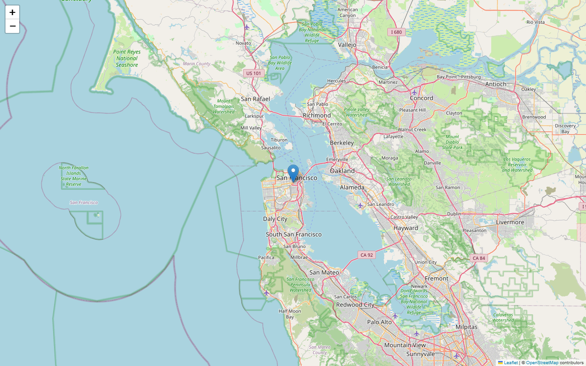

# Phone Location Map

Look up a phone number's region/carrier and render it on an interactive map.

> **Privacy note:** phone prefixes only map to a broad region (country/city).
> This is **not** live GPS tracking. Demo uses the fictional
> `+1 415-555-2671` (555 range) so no real number is exposed.



*Sample: San Francisco, CA for the fictional demo number. Open `sample_map.html` for the interactive version.*

## Features

- E.164 parsing + `possible/valid` checks with clear errors
- Carrier, region, timezone and number-type lookup via `phonenumbers`
- Geocoding via OpenCage (key in `.env`, never committed)
- Auto Folium zoom by granularity (city 10 / state 7 / country 5)
- Rich marker popup, configurable `--output --lang --zoom`

## Quickstart

```bash
pip install -r requirements.txt
copy .env.example .env
# edit .env -> OPENCAGE_API_KEY=your_key_here  (https://opencagedata.com/api)

python main.py --phone "+14155552671"
python main.py --phone "+14155552671" --output sample_map.html
python main.py --help
```

## Project structure

```text
main.py            CLI + lookup + map logic
myphone.py         deprecated empty fallback (use --phone)
requirements.txt   pinned deps
.env.example       key template (.env is git-ignored)
sample_map.html    public demo map (fictional number only)
docs/screenshot.png  screenshot of demo map
my_location.html   local personal runs (git-ignored, never commit)
```

## Security

- No real numbers or API keys in git. `.env`, `.venv/`, `my_location.html` are ignored.
- If you previously hardcoded a key/number, rotate the OpenCage key.

## License

MIT — see `LICENSE`.
